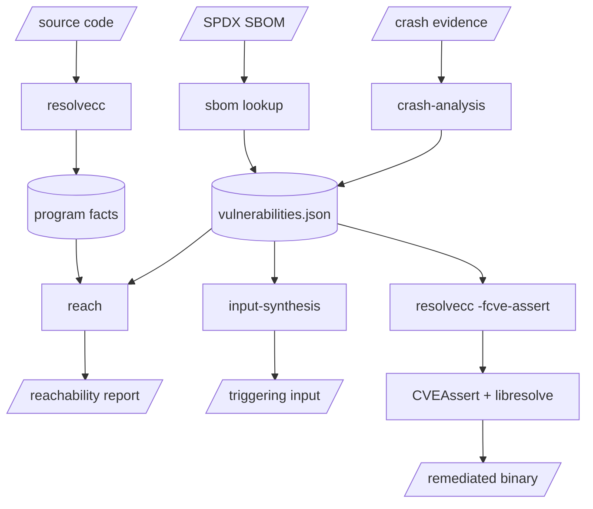

# Architecture

**RESOLVE** is not a single tool but a pipeline of tools that hand work off to one another. They are glued together by a single artifact ([`vulnerabilities.json`](concepts/vulnerabilities-json.md)) which describes a vulnerability precisely enough for every downstream stage to act on it. This page shows how the pieces fit together; each stage has its own [example](examples/reachability.md) and component reference linked below.

## 1. Discover a vulnerability

There are two ways to produce a finding, and both emit the same [`vulnerabilities.json`](concepts/vulnerabilities-json.md):

- **[SBOM lookup](examples/sbom.md)** works *before* you have a crash. It takes your project's [SPDX](https://spdx.dev/) software bill of materials, cross-references each dependency against [NVD](https://nvd.nist.gov/) and [MITRE CWE](https://cwe.mitre.org/), and reports the known CVEs. See the [SBOM component docs](components/resolve-cli/sbom.md).
- **[Crash analysis](examples/crash-analysis.md)** works *after* something breaks. It drives a coding agent through raw crash evidence (core dumps, sanitizer logs, reproducers) and distills it into a structured finding. See the [crash analysis component docs](components/resolve-cli/crash-analysis.md).

Regardless of origin, even if a human writes it themselves, this output is the toolchain's common currency: a [`vulnerabilities.json`](concepts/vulnerabilities-json.md) naming the affected function, file, and weakness class.

## 2. Confirm it is reachable

A finding is a *hypothesis*: the vulnerable function exists, but can attacker-controlled execution actually get there? [Reachability analysis](examples/reachability.md) answers that statically. You compile the target with [`resolvecc`](components/resolve-cc.md), which embeds [program facts](components/facts.md) (a control-flow graph) into the binary. The [`reach`](components/reach.md) tool then consumes those facts plus the `vulnerabilities.json` and searches for a path from the program entry point to the affected function.

## 3. Synthesize a triggering input

Reachability proves a path *can* exist; it does not hand you the bytes that drive execution down it. [Input synthesis](examples/input-synthesis.md) closes that gap by driving a coding agent to reason about the conditions the bug requires and produce a concrete proof-of-vulnerability input. See the [input synthesis component docs](components/resolve-cli/input-synthesis.md).

## 4. Remediate

Finally, [remediation](examples/remediation.md) instruments a fix without touching source. Compiling with [`resolvecc -fcve-assert`](components/resolve-cc.md) applies the [CVEAssert](components/resolve-cveassert.md) LLVM pass, which (together with the [libresolve](components/libresolve.md) runtime) inserts sanitizer checks at the affected function according to the `remediation-strategy` recorded in the finding.

!!! tip
    You do not have to run the whole pipeline. Any stage that produces or consumes a `vulnerabilities.json` can be used on its own. For example, you can feed a hand-written json straight into [remediation](examples/remediation.md), or an [SBOM-generated](examples/sbom.md) one straight into [reachability](examples/reachability.md).
