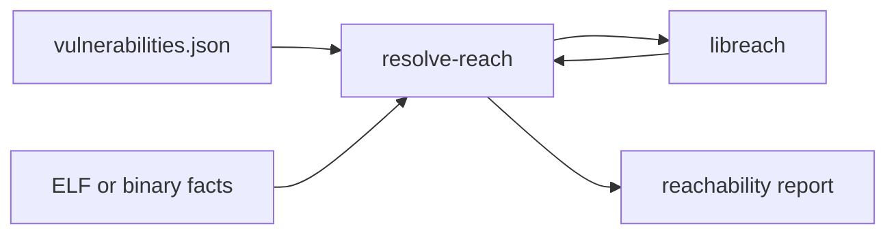

# Reach

`resolve reach` determines whether a program entry point can reach a vulnerable function. It uses static control-flow data from RESOLVE facts.

The command accepts facts from these sources:

- An ELF executable or shared library that contains a `.facts` section.
- An extracted `.facts` file.
- A directory that contains one or more `.facts` files.
- Multiple inputs through repeated `-f` arguments.

The command writes one JSON result for each entry in `vulnerabilities.json`.

## Use the command

```bash
resolve reach \
  --input vulnerabilities.json \
  --facts program.facts \
  --output reach.json
```

The command uses `main` as the default entry point. Use `--entry` to select a different function.

```bash
resolve reach -i vulnerabilities.json -f program.facts -e service_main
```

If you omit `--output`, the command derives the path from the input name. For example, `vulnerabilities.json` produces `vulnerabilities.reach.json`.

Use `--src` to read a package version from a Vcpkg manifest. The result becomes unreachable when the installed version is outside the vulnerable range.

## Dynamic-link analysis

Use `--dynlink` to include compatible external-linkage functions as indirect-call targets.

```bash
resolve reach -i vulnerabilities.json -f program.facts --dynlink
```

Use `--dlsym-log` with `--dynlink` to restrict those targets to observed symbols.

```bash
resolve reach \
  -i vulnerabilities.json \
  -f program.facts \
  --dynlink \
  --dlsym-log dlsym.json
```

The log has this structure:

```json
{
  "loaded_symbols": [
    {
      "symbol": "plugin_entry",
      "library": "libplugin.so"
    }
  ]
}
```

The graph matches the `symbol` value. The `library` value remains available for future matching changes.

## Architecture

The Rust command owns input parsing, function lookup, version comparison, and report generation. It calls `libreach` through a small C interface.



The command loads all facts once. Then it builds one graph and uses that graph for all unresolved sinks.

## Developer commands

Build the command:

```bash
cmake -B build
cmake --build build --target resolve-reach
```

Run its existing tests:

```bash
cmake --build build --target test-resolve-reach
```

See the [reachability example](../examples/reachability.md) for a complete workflow.
