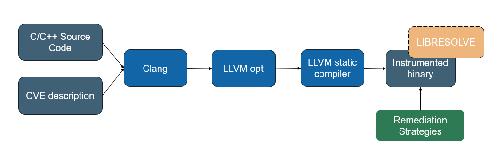

# CVEAssert

CVEAssert is an LLVM compiler pass plugin that instruments programs 
by inserting runtime checks into functions identified by a CVE description. 
It consumes a [CVE description encoded in JSON](../concepts/vulnerabilities-json.md), which is parsed into
an internal representation containing the affected source file, affected function,
CWE identifier, and remediation strategy. Based on this
description, CVEAssert selects and applies the appropriate sanitizer
to each affected function. CVEAssert can optionally be linked with
the [`libresolve`](libresolve.md) runtime library to enforce stack and heap bounds protections. The pass is executed early in the compilation pipeline to allow LLVM's analysis and optimization framework to optimize the injected instrumentation. 

!!! tip
    For a step-by-step walkthrough of instrumenting a fix with CVEAssert, see the [remediation example](../examples/remediation.md).

## Architecture Diagram



## Types of Sanitizers

| Type | Sanitizer |
| --- | --- |
| Arithmetic | Divide by Zero|
| Arithmetic | Integer Overflow | 
| Memory | Heap OOB |
| Memory | Stack OOB |
| Memory | Free Nonheap | 
| Memory | Null Pointer Deref |
| Other | Operation Masking | 

## Directory Structure

```bash
.
├── arith_san.cpp     - Source code for arithmetic sanitizers (i.e. divide by zero, integer overflow)
├── bounds_check.cpp  - Source code for oob memory sanitizers 
├── CVEAssert.cpp     - Driver code 
├── helpers.cpp       - Helper functions
├── null_ptr.cpp      - Source code for null pointer sanitizer
├── undesirableop.cpp - Source code for operation masking sanitizer
└── Vulnerability.hpp - Source code for internal data structure to parse CVE description
```
## Supported Sanitizers 

| Sanitizer | Behavior | 
| --- | --- |
| Divide by Zero | Instruments division and remainder operations with runtime checks that remediate when the divisor is zero. |
| Integer Overflow | Instruments arithmetic operations using *nsw/nuw* and inserts overflow checks where undefined behavior may occur. |
| Heap Out-of-Bounds | Instruments heap loads, stores, and `getelementptr` instructions with runtime checks to enforce heap bounds. |
| Stack Out-of-Bounds | Instruments stack `alloca`, `load`, `store`, and `getelementptr` instructions with runtime checks to enforce stack bounds. | 
| Null Pointer Dereference | Instruments pointer `load` and `store` instructions with runtime checks that check for null dereference. |
| Operation Masking | Replaces selected 'undesirable' function calls with guarded calls that validate operands before execution. |
| Free Nonheap Memory | Instruments calls to `free` with runtime checks that ensure argument is a heap-allocated pointer. |

!!! note
    The CVE description must include an `undesirable-function` field
    for the Operation Masking sanitizer to be applied. If this field
    is not present, Operation Masking is not enabled. 

## Supported Values
Here is a table of weakness identifiers and alternatives that can be used to
activate specific sanitizers.

### Common Mappings

| Weakness Identifiers | Sanitizer |
| --- | --- |
| `190` | Integer Overflow | 
| `369` | Divide by Zero |
| `476` | Null Pointer Dereference |
| `590` | Free Nonheap |
| `121` | Stack OOB |
| `122` | Heap OOB | 

!!! note
    Stack and heap can be activated simultaneously with 
    these weakness identifiers `123`,`125`,`131`, `787`. See "Additional Mappings" below 
    for other supported ids.

### Additional Mappings
CVEAssert recognizes a handful of other `cwe-id` values for compatibility purposes, see below mapping:

| Weakness Identifiers | Sanitizer |
| --- | --- |
| `0` | Enables All Sanitizers | 
| `123` | Write What Where | 
| `119` | OOB | 
| `787` | OOB Write | 
| `125` | OOB Read | 
| `131` | Incorrect Buffer Size | 
| `1335` | Incorrect Bitwise Shift |  

## Remediation Strategies
Remediation strategies define how sanitizers respond to detected errors encountered at runtime. 

| Remediation Strategy | Behavior |
| --- | --- |
| Continue | Invalid operations are ignored and return 0 |
| Exit | Inserts `exit` function call with specified exit code |
| None | Does not perform remediation | 
| Recover | Transfer control to a recovery handler using `longjmp` | 
| Saturate (Sat) | Use saturating arithmetic |
| Widen | Widen potentially overflowing intermediate operations |
| Wrap | Use 2's complement arithmetic | 

### Defaults

#### Arithmetic

The default remediation stategy 
for arithmetic sanitizers is **`Wrap`**, both when 
no strategy is specified and when
an invalid sanitizer-strategy combination
is encountered.

!!! note
    If the divide by zero sanitizer is selected
    with the continue strategy, undefined
    results will return the dividend. 

#### Memory

The default remediation strategy for
memory sanitizers is **`Continue`**, both when no
strategy is specified and when an invalid 
sanitizer-strategy combination is encountered.

!!! note
    Unlike the other strategies, **`RECOVER`** is semi-automatic.
    This strategy requires the programmer to insert a
    *jmp_buf* construct within the program and insert 
    additional logic to cause the program to call setjmp
    to transfer control to a recovery handler.

## Examples
### Arithmetic
```C
#include <limits.h>
int add_user_input(int a, int b) {
  int sum = a + b;
  return sum;
}

int main(int argc, char **argv) {
  int x = INT_MAX;
  int y = 1;
  int result = add_user_input(x, y); 
  return result;
}
```
The program initializes two variables x and y with the values INT_MAX and 1. When these variables are passed to the add_user_input function, the expression a+b can overflow when the mathematical result exceeds INT_MAX. In C, signed integer overflow results in undefined behavior.

When CVEAssert instruments this code, it inserts a check that detects signed integer overflow before performing the addition. If an overflow is detected, the compiler-generated remediation logic invokes the configured remediation strategy. In this example, the saturate strategy is applied, causing the result to be clamped to INT_MAX instead of overflowing.

```C
// Integer overflow

#include <limits.h>
int add_user_input(int a, int b) {
  // -- Instrumentation inserted by CVEAssert --
  int sum;
  // Check for signed integer overflow before addition
  if (__builtin_add_overflow(a, b, &sum)) {
    // Overflow detected -> apply remediation
    sum = __resolve_add_saturate_int(a, b);
  }
  // If no overflow, sum contains correct result.
  return sum;
}

int main(int argc, char **argv) {
  int x = INT_MAX;
  int y = 1;
  int result = add_user_input(x, y); // result == INT_MAX (saturated)
  return resullt; 
}
```
### Memory
```C
// Out-of-bounds Write 
#include <stdlib.h>
void heap_oob_example() {
  int *buf = (int *)malloc(4 * sizeof(int));
  buf[0] = 10;
  buf[1] = 20;
  buf[2] = 30;
  buf[3] = 40;
  buf[4] = 50; // Heap out-of-bounds write
  free(buf);
}
```
This example demonstrates an out of bounds write in `heap_oob_example`.
The program allocates space for four integers on the heap. Valid indices range from zero to three. The write to `buffer[4]` accesses memory beyond the allocated object and results in a heap out-of-bounds write.

When CVEAssert instruments this code, a bounds check is inserted before the store operation. At runtime libresolve retrieves the bounds metadata associated with `buffer`, and the instrumented code verifies that the target address falls within the valid allocation range. Since `buffer[4]` lies outside of the object bounds of the allocated object, the bounds check fails and the the configured remediation strategy is invoked before the invalid write is performed.

```C
#include <stdlib.h>

// Libresolve runtime interface (simplified)
typedef struct { void *base, void *limit} ShadowObjBounds;
extern ShadowObjBounds __resolve_get_bounds(void *addr);

void heap_oob_example() {
  // malloc replaced with __resolve_malloc hook
  int *buf = (int *)__resolve_malloc(4 * sizeof(int));
  buf[0] = 10;
  buf[1] = 20;
  buf[2] = 30;
  buf[3] = 40;

  // -- Instrumentation inserted by CVEAssert --
  ShadowObjBounds bounds = __resolve_get_bounds(buf);
  char *base_addr = (char*)&buf[4];
  size_t access_size = sizeof(int);
  if (base_addr + access_size - 1 >= bounds.limit) {
    // compiler-generated remediation handler
    __cve_remediation_handler();
  }
  buf[4] = 50; // Write occurs if check passes
  __resolve_free(buf);
}
```
### Operation Masking
```C
// Operation Masking Example
#include <string.h>
void process_user(const char *input) {
  char dest[8];
  // Copy user into fixed-sized buffer
  // Vulnerable: strcpy does not check
  // length before writing contents to
  // dest
  strcpy(dest, input);

  printf("Processed: %s\n", dest);
}

int main(int argc, void **argv) {
  process_user(argv[1]);
  return 0;
}
```
Operation masking vulnerabilities occur when an affected function passes arguments to another function, causing the callee to exhibit undefined behavior. Unlike memory and arithmetic vulnerabilities, unsafe behavior may not occur at the point where the invalid value is created, but rather when that value is later consumed by another operation. 
To mitigate these vulnerabilities, CVEAssert generates a sanitized version of the vulnerable function and redirects affected call sites to the sanitized implementation. Instead of performing the original operation, the sanitized function returns its first argument unchanged. This masks the unsafe operation while allowing program execution to continue without triggering the undefined behavior associated with the original function call. Returning the first argument preserves a valid input value while preventing execution of the vulnerable operation, allowing the program to continue with a predictable result.

The original program allocates a fixed buffer on the stack and uses
the strcpy() function to copy the user input into the destination
buffer. Because strcpy() does not verify the size of the destination
buffer is large enough to hold the source string, an oversized input
can overflow the buffer and result in undefined behavior.

When CVEAssert instruments this code, it generates a sanitized
wrapper for strcpy() that returns the first argument rather than
performing the copy operation. The compiler then redirects calls to
strcpy() to the sanitized wrapper, preventing the unsafe operation
from being executed. 

```C
#include <string.h>

// Sanitized wrapper generated by CVEAssert
// Operation masking: return first argument instead of copying.
char *strcpy_masked(char *dest, const char *src) {
  return dest;
}

void process_user(const char *input) {
  char dest[8];
  // Original call to strcpy is replaced by wrapper
  strcpy_masked(dest, input);
  printf("Processed: %s\n", dest);
}

int main(int argc, char **argv) {
  process_user(argv[0]);
  return 0;
}
```
## Testing
To verify correct IR transformations and binary behavior, we developed a testing suite with regression testing. The suite contains testcases for each sanitizer and tests that the resulting binaries perform the intended behaviors with and without the remediation instrumentation. The testing suite can be found in [`resolve-cveassert/tests`](https://github.com/riversideresearch/resolve/tree/main/resolve-cveassert/tests) and the tests can be executed by calling `make test`.
