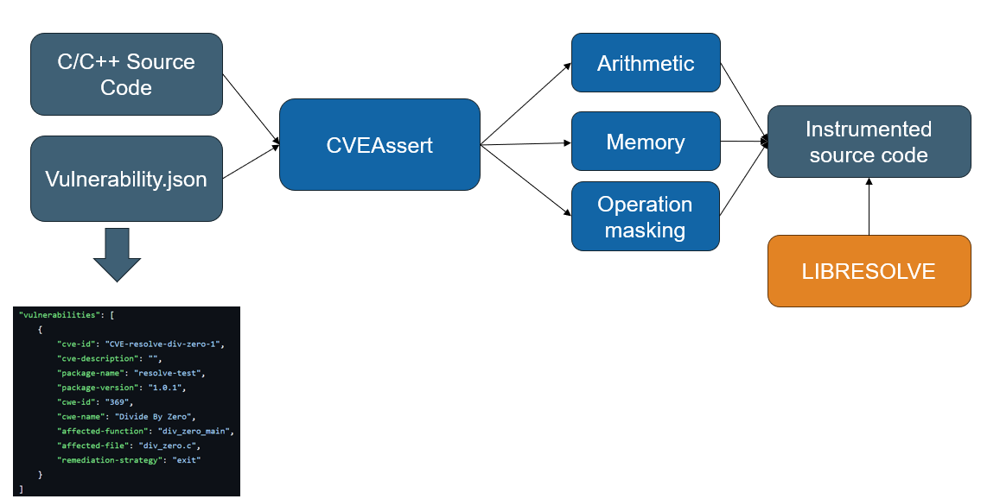

<!--
  Copyright (c) 2025 Riverside Research.
  LGPL-3; See LICENSE.txt in the repo root for details.
-->

# CVEAssert
CVEAssert is a LLVM compiler pass that instruments source code
by inserting runtime checks into a specified affected function. CVEAssert takes a CVE description formatted using a json. The CVE description is parsed into an internal data structure which stores the target file name, function name, weakness ID, and remediation strategy. This pass runs at the beginning of the pipeline to take advantage of LLVM's suite of compiler optimizations.  

## Architecture Diagram


## Types of Sanitizers
| Type | Sanitizer |
| --- | --- |
| Arithmetic | Divide by Zero|
| Arithmetic | Integer Overflow | 
| Memory | Heap OOB |
| Memory | Stack OOB |
| Memory | Null Pointer Deref |
| Other | Operation Masking | 

## Directory Structure
```bash
.
├── arith_san.cpp     - Source code for arithmetic sanitizers (i.e. divide by zero, integer overflow)
├── bounds_check.cpp  - Source code for OOB-access memory sanitizers 
├── CVEAssert.cpp     - Driver code 
├── helpers.cpp       - Helper functions 
├── null_ptr.cpp      - Source code for null pointer sanitizers
├── undesirableop.cpp - Source code for operation masking sanitizer
├── Vulnerability.hpp - Source code for internal data structure to parse CVE description
└── Worklist.hpp      - Source code for internal data structure
```
## Supported Sanitizers 
| Sanitizer | Behavior | 
| --- | --- |
| Divide by Zero | Collects division and remainder operation in vulnerable function. Inserts checks before operations to check if divisors are zero. |
| Integer Overflow | Collects arithmetic instructions in vulnerable function. Checks for the presence of *nsw* and *nuw* flags and inserts arithmetic overflow checking instructions. |
| Heap/Stack OOB | Collects load/store and GEP (getelementptr) instructions in the vulnerable function. Replaces load/store and GEPs with instrumented versions. |
| Null Pointer Dereference | Collects load/store operations in the vulnerable function. Replaces load/store operations with instrumented versions. |
| Operation Masking | Collects function calls in vulnerable function that are "undesirable". Replaces old calls with calls to a sanitized version of the undesirable function that returns the value of the first argument. | 

## Remediation Strategies
Remediation strategies define how sanitizers respond to detected errors. If a sanitizer does not specify a remediation strategy in its internal data structure, the `continue` startegy is used by default. Certain
sanitizer-strategy combinations are invalid; when a combination is encountered, the implementation falls 
back to `continue`. 

| Remediation Strategy | Behavior |
| --- | --- |
| None | Skip remediation for vulnerablility | 
| Recover | Inserts calls to longjmp in affected function | 
| Sat | Applies saturated arithmetic to affected function |
| Exit | Inserts exit function call with specified exit code |
| Continue | Inserts a value that allows program to continue execution |
| Widen | Widen potentially overflowing intermediate operations |

> [!WARNING:]
> The default remediation stategy is
> **`continue`**, both when no strategy is
> specified and when an invalid sanitizer-strategy
> combination is encountered.

> [!NOTE:]
> Unlike the other strategies, RECOVER is semi-automatic.
> This strategy requires the programmer to insert a
> *jmp_buf* construct within the program and insert 
> additional logic to cause the program to call setjmp.

## Example 
```C
// Divide by Zero
int div_zero_main(int argc, const char* argv[]) {        
    int math = (int) (42.0 / (float)argc);
    return 42 % argc + math / argc;
}

int main(int argc, const char* argv[]) {
    // call with 1 arg to trigger div by zero
    return div_zero_main(argc-2, argv);
}
```

Pre-Instrumented IR 
```llvm

```

Post-Instrumented IR
```llvm
```

Talk about the semantic differences between pre and post IR.

## Testing
To verify correct IR transformation and binary behavior, we developed a testing suite with regression testing. The suite contains testcases for each sanitizer and tests that the resulting binaries perform the intended behaviors with and without the remediation instrumentation. The testing suite can be found in *./llvm-plugin/tests/regression* and the tests can be executed by calling *make*. 