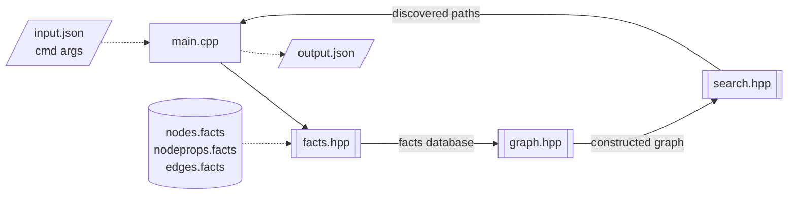

<!--
  Copyright (c) 2025 Riverside Research.
  LGPL-3; See LICENSE.txt in the repo root for details.
-->

# reach

Fast graph reachability for E-BOSS RESOLVE.

## Build

```
cmake -B build && \
cd build; make
```

## Run

```
./build/reach --help
```

## Description

This development is factored into a library part (under `lib/`) and an
executable tool (under `src/`) that uses the library.

See the `--help` output for command line arguments/options.

The minimum required arguments for performing a reachability query are
`--facts_dir` (path to directory containing facts files extracted from
the program binary), and the `--src` and `--dst` node IDs. The tool
will construct a control-flow graph from the facts in `facts_dir`, and
attempt to find the shortest path from `src` to `dst` in it.

The `src` and `dst` node IDs should match how they appear in the facts
files, which is determined by the [RESOLVE LLVM
pass](https://github.com/riversideresearch/resolve/blob/main/llvm-plugin/src/EnhancedFacts.cpp)
that generates the facts.

For example, if `nodeprops.facts` contains the following line:
```
/src/guestbook/src/main.cpp:f_GLOBAL__sub_I_main.cpp,Function
```
there is a node of type `Function` with ID
`/src/guestbook/src/main.cpp:f_GLOBAL__sub_I_main.cpp`.

Arguments can also be specified in an input JSON file instead of as
command line arguments. See the `--input` argument. If an argument is
provided in both the input file and at the command line, the command
line argument takes precedence. The input file format is specified by
the struct `config` in `src/config.hpp` (the JSON deserializer is
auto-generated from this definition).

The input file format supports multiple queries (see struct `query`
and the `queries` field of struct `config` in `src/config.hpp`).

## Architecture

The implementation is organized roughly as follows:



The main reads the input config (plus command line arguments), and
then uses the functionality declared in `lib/facts.hpp` to load the
facts files from the disk into an in-memory database. This database is
used by `lib/graph.hpp` to build a graph, which is passed to
`lib/search.hpp` for finding paths. Finally, the paths are packaged
into a JSON object and written to the provided output path or to
stdout if no path was given.

## Code

Under `lib/`:
- json.hpp
  + open-source (MIT) JSON library from https://github.com/nlohmann/json
- cache.hpp
  + templated helper functions for reading/writing data structures
    (vector, unordered_set, unordered_map) to/from disk
- facts.hpp, facts.cpp
  + in-memory representation of fact databases, and loading from .facts files
  + defns related to dlsym loaded symbol logs from dynamic analysis
- graph.hpp, graph.cpp
  + weighted directed graphs with integer node labels, and functions
    for constructing them from facts databases
  + `handle_map`s for mapping between string node IDs and their
    integer labels (handles)
- search.hpp, search.cpp
  + pathfinding algorithms on graphs. Currently:
    * BFS
	* Dijkstra's shortest path
	* Yen's K-shortest paths
  + also computing distance maps for KLEE (min distance of each node
    in the graph to a specified destination node)
- util.hpp
  + misc helper functions
    * `at` function for vector and unordered_map with slightly better
      error reporting
	* `time` function for measuring time to execute a given function
- distmap.hpp, distmap.cpp
  + compute distance maps and blacklists for directed KLEE

Under `src/`:

- argparse.hpp
  + open-source (MIT) argument parsing library from http://github.com/p-ranav/argparse
- config.hpp
  + specifications of the tool's input and output formats as structs
  + JSON serializers and deserializers are auto-generated from these
    specifications via the Lohmann JSON library
- main.cpp
  + parse arguments, load facts, build graph, perform queries, output
    results
